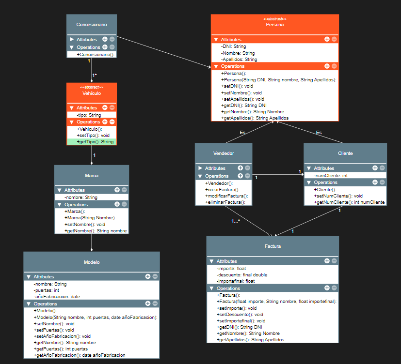

# UML-Cosecha-Propia
### Enunciado
Un concesionario necesita almacenar información sobre los siguientes datos.

Debes crear un diagrama de clases UML que cumpla con los siguientes puntos:

- Un concesionario cuenta con varios vehículos de diferentes marcas y modelos
- Para evitar conflictos. Se necesita saber el nombre de la marca, el nombre del modelo del coche, el número de puertas y el año de fabricación.
- Tanto para los clientes como para los vendedores se necesita saber el DNI, el nombre y los apellidos.
- Un cliente va al concesionario y puede comprar un coche a un vendedor, por tanto un vendedor tiene asociado un cliente.
- Una vez el cliente es registrado como cliente en la empresa, se le asigna un numero identificativo.
- El vendedor tiene que poder crear, modificar y eliminar la factura aplicando un descuento obligatorio de un 5%. La factura debe contener el importe, y después el importe final con el descuento aplicado.

### Solución

